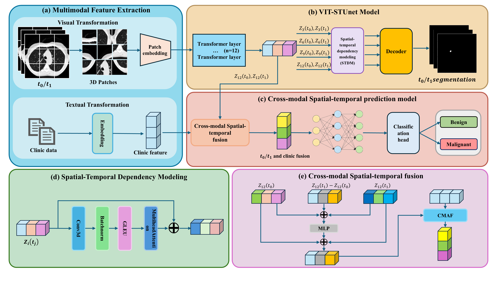
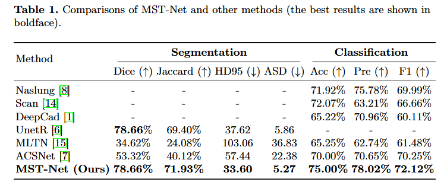

# MST-NET: Multimodal SpatioTemporal Network for Pulmonary Nodule Segmentation and Prognosis


## Proposed method
Overview of our MST-Net. It comprises three parts: (a) multimodal feature extraction module (visual and textual data), (b) the Vit-STUnet module for lung nodule detection and segmentation, and (c) a cross-modal spatiotemporal prediction module that fuses imaging and clinical data from different time points using CMSTF for final prediction.



## Experiment result
We compared our results with other state-of-the-art methods, and our results were better than any other comparison method. In summary, the MST-Net model, trained with a combination of multimodal data and spatiotemporal information, demonstrates superior performance in tasks of pulmonary nodule segmentation and prognosis compared to models trained using single-modality, single-time point, or planar data.



## Pre-requisties
* Linux

* Python>=3.7

* NVIDIA GPU + CUDA12.1 cuDNN8.9

## Getting started to evaluate
### Install dependencies
```
pip install -r requirements.txt
```

## Data Preparation
The dataset we use comes from the National Lung Screening Trial (NLST with the original data available for download at https://cdas.cancer.gov/learn/nlst/images/.) initiated by the National Cancer Institute, which includes 150 participants annotated by doctors. Each participant must have at least two longitudinal CT scans and clinical data (age, gender, smoking status, screening results). The nodular malignant tumor was confirmed by pathological criteria, with a three-dimensional size of 16 × 512 × 512. Perform five fold cross validation on the dataset in a 4:1 ratio.

## Train
* training for segmentation：
```
python Train_Seg_5.py
``` 
* training for predication：
```
python train_cls.py
``` 
